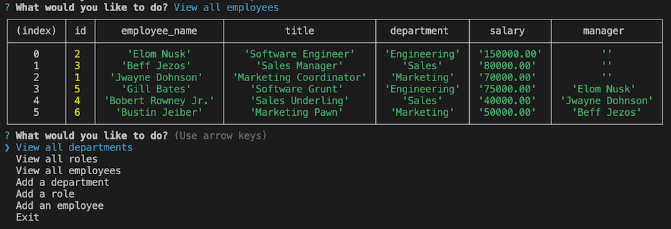

# Employee Tracker


[](https://opensource.org/licenses/MIT)
<br>
## Description

This project is a command-line application that allows non-developers to easily view and interact with information stored in the database.
<br><br>
The way data is stored in the database isn't always the most helpful in terms of readability so one of the challenges with this project was making the user selections clear. Users needed department, title, and name options in the prompts while the database required id values to add new entries.

- Map was crucial to accessing both pieces of information. 
- I also learned that ChatGPT is a valuable tool to help resolve syntac errors quickly.

## Installation

1. Make sure you have Node.js installed on your computer.

2. Clone this repository to your local machine.

3. Open a terminal or command prompt and navigate to the project directory.

4. Install the project dependencies by running the following command: npm install

5. Create a .env file in the root of your project directory and add your MySQL database credentials to it. The format should be as follows:

```
DB_HOST=localhost
DB_USER=<your_mysql_username>
DB_PASSWORD=<your_mysql_password>
DB_NAME=<your_database_name>
```

Note: Make sure to replace <your_mysql_username>, <your_mysql_password>, and <your_database_name> with your actual database credentials.

## Usage

Once you've installed the dependencies and added your database credentials to the .env file, you can start the application by running the following command: node index.js
You will be asked what you would like to do and given the options to view all departments, roles, or employees, as well as adding a department, role, or employee.

Once a selection is made you will either be shown the desired table, or promoted to create a new entry into your desired table.



The option to exit the application is at the end of the initial prompt options as well.

[Video Demo](https://drive.google.com/file/d/1d5h182K-jIFLVPXwmiiYDHypWbM87Xtf/view)


## License

MIT License

Copyright (c) 2023 Kate Rogers

Permission is hereby granted, free of charge, to any person obtaining a copy
of this software and associated documentation files (the "Software"), to deal
in the Software without restriction, including without limitation the rights
to use, copy, modify, merge, publish, distribute, sublicense, and/or sell
copies of the Software, and to permit persons to whom the Software is
furnished to do so, subject to the following conditions:

The above copyright notice and this permission notice shall be included in all
copies or substantial portions of the Software.

THE SOFTWARE IS PROVIDED "AS IS", WITHOUT WARRANTY OF ANY KIND, EXPRESS OR
IMPLIED, INCLUDING BUT NOT LIMITED TO THE WARRANTIES OF MERCHANTABILITY,
FITNESS FOR A PARTICULAR PURPOSE AND NONINFRINGEMENT. IN NO EVENT SHALL THE
AUTHORS OR COPYRIGHT HOLDERS BE LIABLE FOR ANY CLAIM, DAMAGES OR OTHER
LIABILITY, WHETHER IN AN ACTION OF CONTRACT, TORT OR OTHERWISE, ARISING FROM,
OUT OF OR IN CONNECTION WITH THE SOFTWARE OR THE USE OR OTHER DEALINGS IN THE
SOFTWARE.
